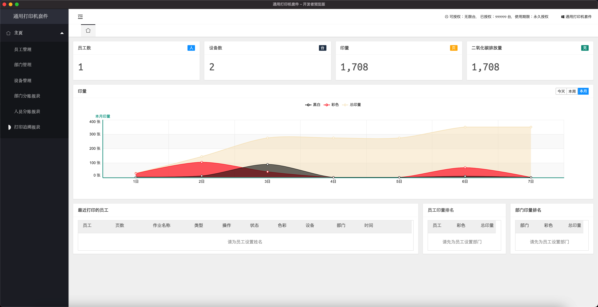



## FSD_PrinterSuite是什么?
一个在OSX平台上运行的打印机套件（本套件不支持`Windows`）

## FSD_PrinterSuite有哪些功能？
* 方便的`设备管理`功能
* 配套的`员工管理`功能
* 配套的`部门管理`功能
* `人员分账报表`功能，可查询每位员工对打印机使用情况并且导出到csv文件
* `部门分账报表`功能，可查询每个部门对打印机使用情况并且导出到csv文件
* 强大的`打印追溯报表`，可追溯每一个打印作业并且导出到csv文件

## FSD_PrinterSuite 支持哪些打印机？
* 富士施乐多功能一体机
* 部分Brother小型机

## FSD_PrinterSuite SDK
* FSD_PrinterSuite 支持`第三方插件`（联系我们 [business@fsd.com](mailto:business@fsd.com)）
* FSD_PrinterSuite 提供可供程序员使用的`SDK`（联系我们 [business@fsd.com](mailto:business@fsd.com)）
* FSD_PrinterSuite 也可以提供`定制化版本`（联系我们 [business@fsd.com](mailto:business@fsd.com)）

## 下载地址
[FSD_PrinterSuite](https://github.com/shgic/FSD_PrinterSuite/releases)

## 问题反馈
在使用中有任何问题，欢迎反馈给我们，可以用以下联系方式跟我们交流
* 邮件 [上海丰思达商务咨询中心](mailto:www.baidu.com)
* weibo: [@上海丰思达商务咨询中心](https://weibo.com/)

## 关于
```javascript
typedef struct tagWHOAMI {
public:
    Company = "上海丰思达商务咨询中心";
    Copyright = "FSD_PrinterSuite 为个人免费版，禁止任何商业用途. 本公司在法律允许的范围内保留最终解释权";
    tagWHOAMI::tagWHOAMI() { }
} WHO_AM_I;
```
